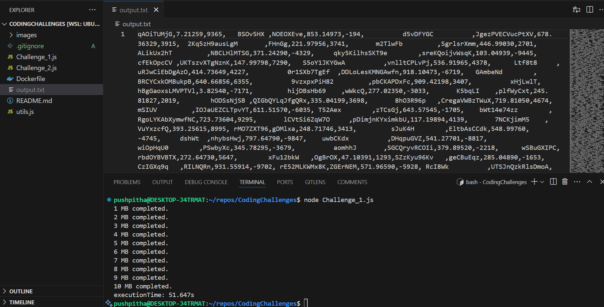
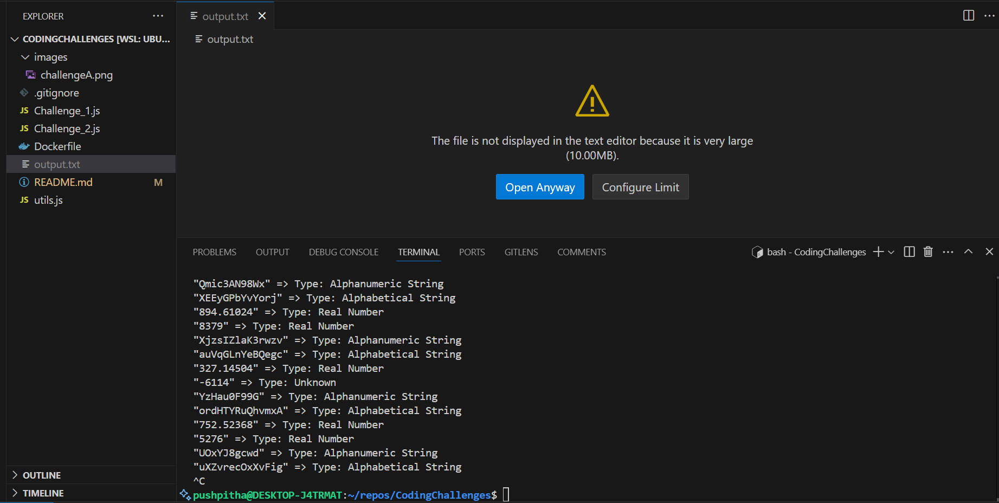
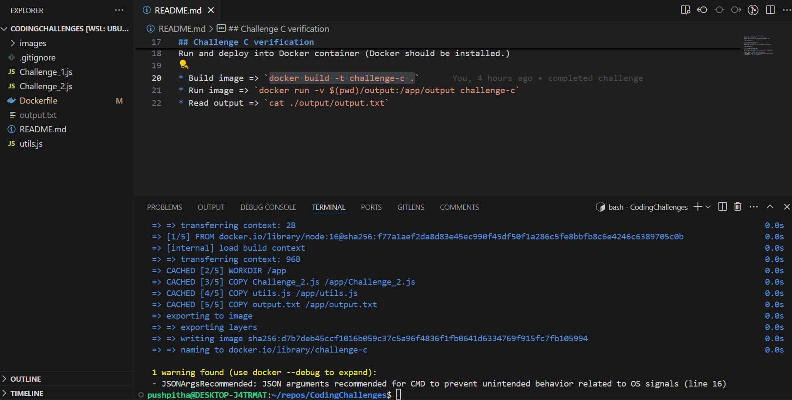
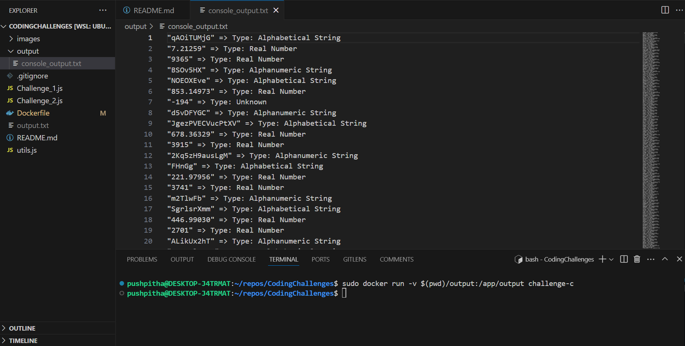

### Written in JavaScript. Use Node to execute source code.

To improve performance, file writting has been split into 10 parts 1 MB each. After generating all 10MB object files, those files are merged together. The final file size 10MB is fixed, so dynamic threads were not used. A Timer has been used to measure the execution time as a way of tracking the performance.

Alternative approach : We can use 10 worker threads to parallelly generate 1 MB objects and later merge them to create a single 10MB file.

## Challenge A verification
Step 1 : Run `Challenge_1.js` to generate the objects file

Command : `node Challenge_1.js`

Result : Execution time = 51.65 seconds

## Challenge B verification
Step 2 : Run `Challenge_2.js` to print objects in the console

Command : `node Challenge_2.js`

Result :

## Challenge C verification
Run and deploy into Docker container (Docker should be installed.)

* Start Docker => `sudo systemctl start docker`

* Build image => `docker build -t challenge-c .`

* Run image => `docker run -v $(pwd)/output:/app/output challenge-c`
* Read output => `cat ./output/output.txt`

